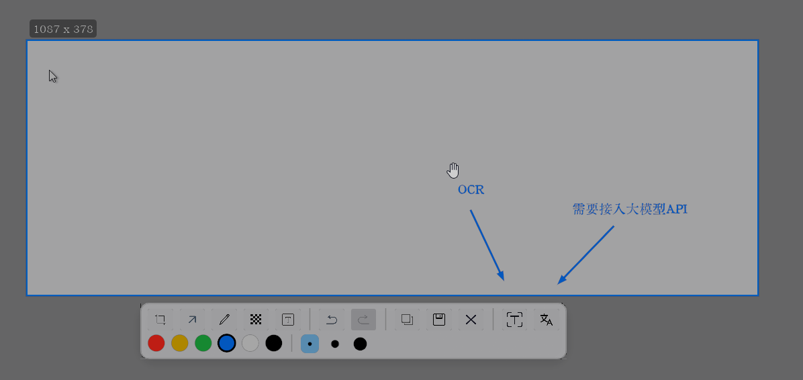
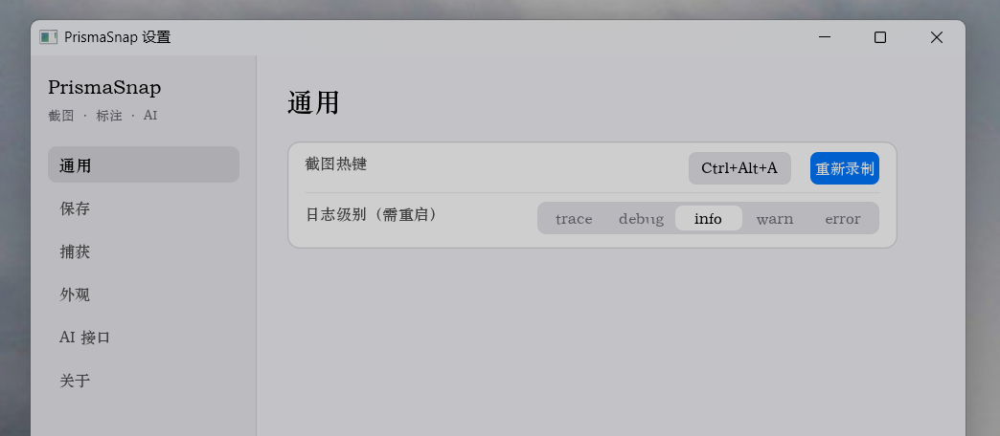

# PrismaSnap

Windows 11 截图工具，便携版。按 `Ctrl+Alt+A` 截屏，拖动框选，标注后复制或保存；还能提取图中文字、把翻译结果直接盖在原文上。



## 功能

- **全局热键截图**：默认 `Ctrl+Alt+A`（可在设置中改键）。截取鼠标所在显示器，拖动框选，松手后直接标注、复制或保存。
- **标注**：矩形、箭头、画笔、马赛克（像素化 / 模糊 / 纯色）、文字，支持撤销 / 重做，预览与导出效果一致。
- **提取文字**：框选后一键把图中文字复制到剪贴板。内置 Windows 系统 OCR 开箱即用；可选装 RapidOCR 插件，小字、密集排版、艺术字的识别效果明显更好。
- **翻译**：译文直接渲染覆盖在原文字上，字号自适应、颜色随原文。需要配置一个 OpenAI 兼容接口，可接 llama.cpp / Ollama 等本地服务。
- **HDR 正确**：系统开启 HDR 时截图不过曝、不发灰。预览完整还原屏幕高光，导出图片与 Windows 自带截图一致。
- **便携**：解压即用，配置、日志、截图都存在程序目录，不写注册表。卸载就是删文件夹。

## 下载与运行

从 [Releases](https://github.com/xivna/PrismaSnap/releases) 下载：

| 包 | 说明 |
| :--- | :--- |
| `PrismaSnap_<版本>_portable.zip` | 主程序（exe + 使用说明 + LICENSE），约 6MB，必下 |
| `PrismaSnap_<版本>_OCR插件包.zip` | 高精度 OCR 模型，约 31MB，可选 |

1. 解压主程序包到任意目录，双击 `PrismaSnap.exe`。
2. 启动后没有窗口，只有托盘图标：**双击**托盘图标打开设置，右键托盘图标可退出。
3. 按 `Ctrl+Alt+A` 开始第一次截图。

装 OCR 插件（可选）：解压插件包，把里面的 `plugins` 文件夹合并到程序目录（与 `PrismaSnap.exe` 同级）后重启；也可以在 设置 → AI 接口 → 「OCR插件下载」中在线下载。



## 快捷键

| 按键 | 作用 | 可自定义 |
| :--- | :--- | :--- |
| `Ctrl+Alt+A` | 触发截图 | 是 |
| `Esc` | 取消截图 / 关闭编辑 | 否 |
| `Enter` / `Ctrl+C` | 复制到剪贴板 | 否 |
| `Ctrl+S` | 保存到文件 | 否 |
| `Ctrl+Z` | 撤销标注 | 否 |
| `Ctrl+Shift+Z` / `Ctrl+Y` | 重做标注 | 否 |

标注工具用法、AI 接口配置、保存设置等完整说明见 **[使用说明](docs/使用说明.md)**（压缩包内附同名文件）。

## 常见问题

**HDR 屏幕上预览很亮，保存的图片却偏暗？**
预期行为：预览完整还原屏幕所见（含 HDR 高光），导出按 SDR 标准映射，与 Windows 自带截图一致。

**提取文字 / 翻译失败？**
提取文字只依赖 OCR，开箱即用；翻译需要在 设置 → AI 接口 中填好地址、Key、模型，且服务已启动。排查步骤见使用说明 FAQ。

**装了 OCR 插件但没生效？**
确认 `plugins/ocr/` 下 `det.onnx`、`rec.onnx`、`keys.txt`、`onnxruntime.dll` 四个文件齐全、位置正确；替换过 `onnxruntime.dll` 需重启程序。

## 从源码构建

需要 Rust 工具链与 `x86_64-pc-windows-msvc` 目标（WSL2 交叉编译需 xwin + lld-link）：

```bash
cargo build --target x86_64-pc-windows-msvc --release
cargo test                    # 纯逻辑单元测试
scripts/package.sh [输出目录]  # 发布打包（主包 + OCR 插件包）
```

## 文档

| 文件 | 内容 |
| :--- | :--- |
| [`docs/使用说明.md`](docs/使用说明.md) | 用户手册（安装 / 快捷键 / 标注 / AI 配置 / FAQ） |

## 开源协议

[GPL-3.0-only](LICENSE)。
